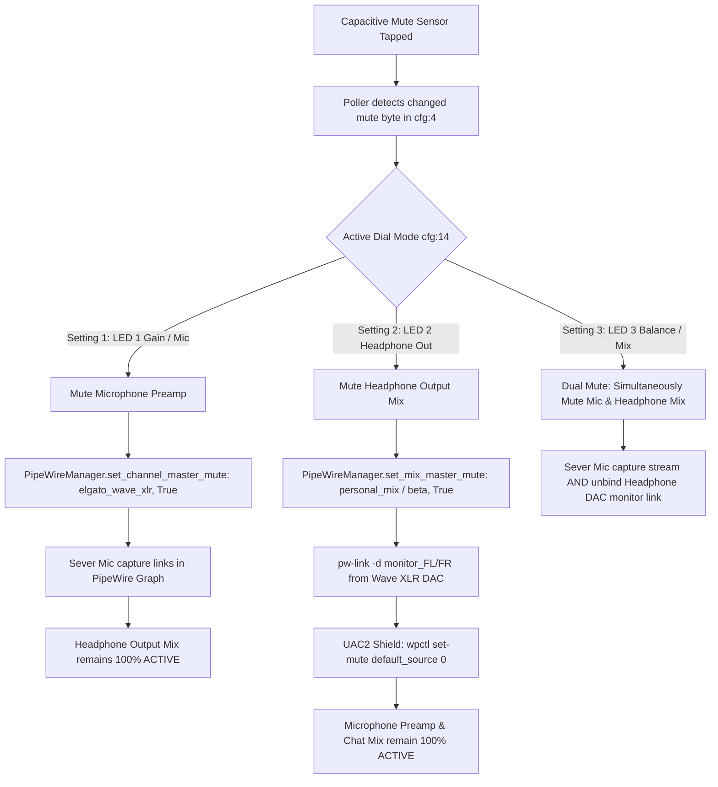

# WaveController — Elgato Wave Hardware & PipeWire Audio Architecture
**Technical Specification, Reverse-Engineered USB Vendor Protocols, Multi-Mix Routing Engine & `udev` Hardware Permissions**

---

## 1. Executive Overview & System Topology

WaveController delivers native, hardware-level integration for the **Elgato Wave product family** (Wave XLR, Wave:3, and Wave:1) on Linux. The system combines low-level USB vendor control transfers with modern PipeWire DSP submixing to achieve real-time volume management, mode-isolated capacitive muting, LED personalization, and sub-millisecond audio routing.

```mermaid
flowchart TB
    subgraph HW["Elgato Wave XLR / Wave:3 Physical Hardware"]
        Dial["Rotary Dial (Click to Cycle Modes)"]
        Sensor["Capacitive Mute Sensor (Top Plate)"]
        PwrHold["2-Second Dial Push (48V Toggle)"]
        Ring["Multi-Color LED Ring & Mode Indicators"]
    end

    subgraph USB_Layer["Low-Level USB Vendor Engine (elgato_wave.py)"]
        Libusb["libusb Control Transfers (0x0FD9:0x007D / 0x0063 / 0x0070)"]
        Poller["40 Hz Non-Blocking Hardware Polling Loop"]
        LEDTrans["LED Color Engine & Transient Peek Restorer"]
    end

    subgraph Core_Engine["WaveController Core Subsystem"]
        USBHW["USBHardwareManager (usb_hardware.py)"]
        PW["PipeWireManager (pipewire_manager.py)"]
        CFG["ConfigManager (~/.config/WaveController/config.json)"]
    end

    subgraph PW_Graph["PipeWire Audio Graph (0ms Real-Time Routing)"]
        MicIn["Physical Wave XLR Mic In (ALSA Node)"]
        ChatSource["WaveController_chat_mix_Source"]
        NullSinks["Virtual Mix Sinks (beta, mobo, custom)"]
        HeadphoneDAC["Physical Wave XLR Headphone DAC (ALSA Playback)"]
    end

    HW <-->|USB Vendor Protocol (wIndex=0x3303)| Libusb
    Libusb --> Poller
    Poller --> USBHW
    USBHW <--> CFG
    USBHW <--> PW
    PW <--> PW_Graph
```

---

## 2. Low-Level Elgato USB Vendor Protocol

The Elgato Wave family communicates over USB Audio Class (UAC2) for PCM streams and custom USB Vendor Control transfers for hardware parameters.

### 2.1 Supported Hardware Profiles
| Device Name | Vendor ID (`VID`) | Product ID (`PID`) | Interface | Endpoint / `wIndex` |
| :--- | :--- | :--- | :--- | :--- |
| **Elgato Wave XLR** | `0x0FD9` | `0x007D` | Interface 3 | `0x3303` |
| **Elgato Wave:3** | `0x0FD9` | `0x0063` | Interface 3 | `0x3303` |
| **Elgato Wave:1** | `0x0FD9` | `0x0070` | Interface 3 | `0x3303` |

### 2.2 USB Control Transfer Parameters
* **Read Request (`RT_CLASS_IN`)**: `bmRequestType = 0xA1`, `bRequest = 0x01`
* **Write Request (`RT_CLASS_OUT`)**: `bmRequestType = 0x21`, `bRequest = 0x09`
* **`wValue` (Config Buffer)**: `0x0100` (Configuration packet payload)
* **`wValue` (Device Info)**: `0x0200` (Firmware version, serial string, API version)
* **Packet Size**: 34 Bytes (`0x22`)

### 2.3 34-Byte Hardware Configuration Memory Layout

```
Offset (Hex/Dec)   Type      Field Description & Bitmask
------------------------------------------------------------------------------------------------------
0x00 (0)           uint8     Report ID (Fixed 0x01)
0x01..0x03 (1..3)  uint8[3]  Header / Reserved (0x00, 0x00, 0x00)
0x04 (4)           uint8     Hardware Mute Register (0x00 = Unmuted, 0x01 = Hardware Preamp Muted)
0x05 (5)           uint8     Reserved
0x06..0x07 (6..7)  uint16_LE Microphone Preamp Gain Raw (0x0000 = 0 dB, 0x002B..0xFFFF = Up to 75 dB)
0x08 (8)           uint8     Headphone Monitor Volume (0x00 = 0%, 0x64 = 100%)
0x09 (9)           uint8     Mic/PC Sidetone Crossfade Balance (0x00 = 100% Mic, 0x64 = 100% PC Audio)
0x0A (10)          uint8     48V Phantom Power Toggle (0x00 = OFF, 0x01 = ON)
0x0B (11)          uint8     Enhanced Low-Cut Filter (0x00 = OFF, 0x01 = 80 Hz, 0x02 = 120 Hz)
0x0C (12)          uint8     Analog Clipguard Compressor (0x00 = OFF, 0x01 = ON)
0x0D (13)          uint8     Reserved
0x0E (14)          uint8     Rotary Dial Active Mode (0x01 = Gain, 0x02 = Headphone Out, 0x03 = Balance)
0x0F (15)          uint8     Reserved
0x10..0x12 (16..18) uint8[3] Gain Mode LED Color Bank (R, G, B: 0..255)
0x13..0x15 (19..21) uint8[3] Headphone Mode LED Color Bank (R, G, B: 0..255)
0x16..0x18 (22..24) uint8[3] Sidetone Balance LED Color Bank (R, G, B: 0..255)
0x19..0x1B (25..27) uint8[3] Mute Indicator Ring Color Bank (R, G, B: 0..255)
0x1C..0x21 (28..33) uint8[6] Reserved / Checksum Padding
```

---

## 3. Mode-Isolated Capacitive Muting Architecture

In factory Elgato firmware, touching the top capacitive plate always sends a UAC2 hardware capture mute packet to the host operating system. WaveController decouples this behavior in software to provide **context-sensitive, dynamic muting based on the active rotary dial setting**.



### 3.1 Mode Isolation Matrix
| Hardware Dial LED | Active Mode | Hardware Tap-to-Mute Action | Software Audio State |
| :--- | :--- | :--- | :--- |
| **LED 1 (Mic Icon)** | `gain` | Mutes **Microphone Only** (`elgato_wave_xlr` / `mic`). | Stream/Discord muted; Spotify and game audio in headphones stay $100\%$ active. |
| **LED 2 (Headphone Icon)** | `hp` | Mutes **Headphone Output Mix Only** (`beta` / `personal_mix`). | Headphone audio silenced instantly with $0\text{ms}$ latency; Mic and Chat Mix stay active. |
| **LED 3 (Balance Icon)** | `mix` | **Dual Mute**: Mutes **both** Microphone and Headphone Output Mix. | Complete broadcast and personal monitoring silence. |

### 3.2 Linux Kernel UAC2 Shielding Mechanism
When tapping capacitive mute while on **Setting 2 (Headphone mode)**, the Linux ALSA driver automatically intercepts the UAC2 HID packet and marks `@DEFAULT_AUDIO_SOURCE@` as `[MUTED]`.
WaveController neutralizes this side-effect:
1. `USBHardwareManager` immediately dispatches `wpctl set-mute @DEFAULT_AUDIO_SOURCE@ 0` to un-clamp ALSA.
2. `PipeWireManager` skips generic ALSA sync by identifying the active Elgato hardware profile (`is_elgato == True`).
3. Software keeps `channel_master_states["elgato_wave_xlr"]["muted"] = False` so live voice capture is uninterrupted.

---

## 4. PipeWire Graph & Multi-Track Virtual Routing

WaveController bypasses traditional single-sink desktop limitations by provisioning virtual PipeWire submixes, custom loopbacks, and dynamic port linkers.

```mermaid
graph LR
    subgraph Inputs["Audio Applications & Capture"]
        Spotify["Spotify Audio Stream"]
        Game["Game Audio Stream"]
        Discord["Discord Voice Stream"]
        WaveMic["Physical Wave XLR Mic In"]
    end

    subgraph Submixes["Virtual Matrix Loopbacks (pw-loopback)"]
        Sub_Spot_Beta["Submix: Spotify -> beta (5ms latency)"]
        Sub_Spot_Mobo["Submix: Spotify -> mobo mix (5ms latency)"]
        Sub_Game_Beta["Submix: Game -> beta (5ms latency)"]
        Sub_Mic_Chat["Submix: Wave Mic -> Chat Mix"]
    end

    subgraph Sinks["PipeWire Virtual Null Sinks"]
        Sink_Beta["WaveController_personal_mix_Sink (beta)"]
        Sink_Mobo["WaveController_mobo_mix_Sink (mobo mix)"]
        Source_Chat["WaveController_chat_mix_Source (Broadcast Mic)"]
    end

    subgraph Outputs["Physical Output Endpoints"]
        ElgatoDAC["alsa_output.usb-Elgato_Wave_XLR... (Headphones)"]
        MoboDAC["alsa_output.pci-0000_14_00.4... (Speakers)"]
        OBS["OBS Studio / Discord Input Stream"]
    end

    Spotify --> Sub_Spot_Beta --> Sink_Beta
    Spotify --> Sub_Spot_Mobo --> Sink_Mobo
    Game --> Sub_Game_Beta --> Sink_Beta
    WaveMic --> Sub_Mic_Chat --> Source_Chat

    Sink_Beta -->|pw-link monitor_FL/FR (Severed on Mute)| ElgatoDAC
    Sink_Mobo -->|pw-link monitor_FL/FR| MoboDAC
    Source_Chat --> OBS
```

### 4.1 Real-Time Monitor Mix Severing
When a user mutes a mix (e.g. `personal_mix` / `beta`):
1. `_sync_mix_physical_output_routing()` detects `is_mix_muted == True`.
2. PipeWire executes:
   ```bash
   pw-link -d WaveController_personal_mix_Sink:monitor_FL alsa_output.usb-Elgato_Systems_Elgato_Wave_XLR...:playback_FL
   pw-link -d WaveController_personal_mix_Sink:monitor_FR alsa_output.usb-Elgato_Systems_Elgato_Wave_XLR...:playback_FR
   ```
3. Audio ceases to flow to the headphone DAC immediately.
4. When unmuted, `pw-link` reattaches the monitor ports in $<1\text{ms}$ with smooth audio resumption.

---

## 5. Persistence & Multi-Machine Portability

All hardware configurations are $100\%$ portable across any Linux distribution running PipeWire:

1. **Hardware State Schema (`~/.config/WaveController/config.json`)**:
   ```json
   {
     "hardware_settings": {
       "gain_db": 58,
       "phantom_power": true,
       "clipguard": true,
       "low_cut": "80Hz",
       "led_colors": {
         "gain": "#2ECC71",
         "hp": "#2ECC71",
         "mix": "#FF9500",
         "mute": "#FF0000"
       }
     }
   }
   ```
2. **Zero Hardcoded Machine IDs**:
   * Hardware binding queries USB descriptors and ALSA udev properties dynamically.
   * Device swapping or migrating to new hardware automatically rebinds existing mixer matrix configurations.

---

## 6. Linux USB Permissions & `udev` Rules Architecture

On modern Linux systems, direct USB hardware control via raw control transfers (`libusb_control_transfer`) is restricted to `root` users by default. Standard non-root user processes cannot claim interfaces or write configuration packets to `/dev/bus/usb/*` without explicit permissions.

### 6.1 Anatomy of `99-elgato-wave.rules`
The udev rules file (`data/99-elgato-wave.rules`) grants seamless non-root permissions to the logged-in desktop user:

```udev
# Elgato Wave XLR, Wave:3, Wave:1 and Audio Hardware USB Permissions
SUBSYSTEM=="usb", ATTRS{idVendor}=="0fd9", ATTRS{idProduct}=="007d", MODE="0666", TAG+="uaccess"
SUBSYSTEM=="usb", ATTRS{idVendor}=="0fd9", ATTRS{idProduct}=="0070", MODE="0666", TAG+="uaccess"
SUBSYSTEM=="usb", ATTRS{idVendor}=="0fd9", ATTRS{idProduct}=="0088", MODE="0666", TAG+="uaccess"
SUBSYSTEM=="usb", ATTRS{idVendor}=="0fd9", ATTRS{idProduct}=="0084", MODE="0666", TAG+="uaccess"
SUBSYSTEM=="usb", ATTRS{idVendor}=="0fd9", ATTRS{idProduct}=="008f", MODE="0666", TAG+="uaccess"
SUBSYSTEM=="usb", ATTRS{idVendor}=="0fd9", MODE="0666", TAG+="uaccess"
```

### 6.2 Key Attribute Directives Explained
* **`SUBSYSTEM=="usb"`**: Restricts matching to the Linux USB kernel subsystem (`/dev/bus/usb/BBB/DDD`).
* **`ATTRS{idVendor}=="0fd9"`**: Targets all hardware manufactured by **Elgato Systems GmbH**.
* **`ATTRS{idProduct}=="007d"`**: Matches specific hardware models (e.g. `0x007D` for Wave XLR, `0x0070` for Wave:1, `0x0088` / `0x0084` for Wave:3).
* **`MODE="0666"`**: Grants read and write permissions (`rw-rw-rw-`) to the underlying character device node.
* **`TAG+="uaccess"`**: Automatically adds the device node to `systemd-logind`'s dynamic Access Control List (ACL). This assigns hardware ownership directly to the currently active graphical desktop session user without requiring manual user group additions (such as adding the user to the `audio` or `dialout` groups).

### 6.3 Installation and Activation Protocol
To install and trigger the rules without rebooting:
```bash
curl -fsSL https://raw.githubusercontent.com/oparada1988/WaveController/main/data/99-elgato-wave.rules | sudo tee /etc/udev/rules.d/99-elgato-wave.rules > /dev/null && sudo udevadm control --reload-rules && sudo udevadm trigger && echo "✔ Elgato Wave udev rules successfully installed and activated!"
```

---

*Document compiled and verified against WaveController v0.0.0.6 (Pre-Alpha 6).*
